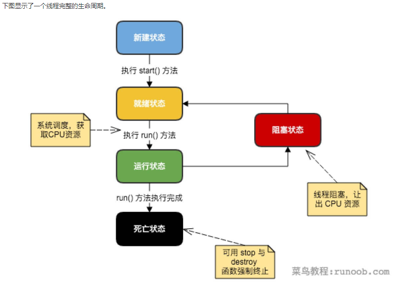

## 项目主要为java多线程巩固基础
#### 线程的生命周期

#### 线程的优先级
每一个 Java 线程都有一个优先级，这样有助于操作系统确定线程的调度顺序。
Java 线程的优先级是一个整数，其取值范围是 1 （Thread.MIN_PRIORITY ） - 10 （Thread.MAX_PRIORITY ）。
默认情况下，每一个线程都会分配一个优先级 NORM_PRIORITY（5）。
具有较高优先级的线程对程序更重要，并且应该在低优先级的线程之前分配处理器资源。但是，线程优先级不能保证线程执行的顺序，而且非常依赖于平台。
#### 创建新线程
Java语言内置了多线程支持。当Java程序启动的时候，实际上是启动了一个JVM进程，然后，JVM启动主线程来执行main()方法。在main()方法中，我们又可以启动其他线程。
要创建一个新线程非常容易，我们需要实例化一个Thread实例，然后调用它的start()方法

#### Java 提供了四种创建线程的方法：
通过继承 Thread 类本身；
通过实现 Runnable 接口；
通过 Callable 和 Future 创建线程；
通过线程池创建线程。

#### 线程池
优势：1）降低资源消耗。通过重复利用已创建的线程降低线程创建和销毁造成的消耗。
   （2）提高响应速度。当任务到达时，任务可以不需要等到线程创建就能立即执行。
   （3）提高线程的可管理性。线程是稀缺资源，如果无限制的创建，不仅会消耗系统资源，还会降低系统的稳定性，使用线程池可以进行统一的分配，调优和监控。
线程池的真正实现类是ThreadPoolExecutor  其构造方法有如下4种:

public ThreadPoolExecutor(int corePoolSize,
                          int maximumPoolSize,
                          long keepAliveTime,
                          TimeUnit unit,
                          BlockingQueue<Runnable> workQueue) {
       this(corePoolSize, 
       maximumPoolSize,
       keepAliveTime,
       unit,
       workQueue,
       Executors.defaultThreadFactory(),
       defaultHandler);} 
       
public ThreadPoolExecutor(int corePoolSize, 
                                int maximumPoolSize,
                                long keepAliveTime, 
                                TimeUnit unit,
                                BlockingQueue<Runnable> workQueue,
                                ThreadFactory threadFactory) {    
       this(corePoolSize,
       maximumPoolSize,
       keepAliveTime, 
       unit, 
       workQueue,
       threadFactory, 
       defaultHandler);}

public ThreadPoolExecutor(int corePoolSize,
                            int maximumPoolSize,
                            long keepAliveTime,
                            TimeUnit unit,
                            BlockingQueue<Runnable> workQueue,
                            RejectedExecutionHandler handler) {
this(corePoolSize, 
maximumPoolSize, 
keepAliveTime, 
unit, 
workQueue,
Executors.defaultThreadFactory(), handler);} 

public ThreadPoolExecutor(int corePoolSize,
                        int maximumPoolSize,
                        long keepAliveTime,
                        TimeUnit unit,
                        BlockingQueue<Runnable> workQueue,
                        ThreadFactory threadFactory,
                        RejectedExecutionHandler handler) {
if (corePoolSize < 0 ||maximumPoolSize <= 0 ||maximumPoolSize < corePoolSize ||keepAliveTime < 0)throw new IllegalArgumentException();
if (workQueue == null || threadFactory == null || handler == null)throw new NullPointerException();
this.corePoolSize = corePoolSize;
this.maximumPoolSize = maximumPoolSize;
this.workQueue = workQueue;
this.keepAliveTime = unit.toNanos(keepAliveTime);
this.threadFactory = threadFactory;
this.handler = handler;}

### 
可以看到，其需要如下几个参数：
corePoolSize (必需) 核心线程数，默认情况下，核心线程会一直存活，但是当allowCoreThreadTimeOut设置为true时，核心线程也会超时回收
maximumPoolSize(必需)，线程池所能容纳最大的线程数，当活跃的线程数到达该数值后，后续的新任务将会阻塞。
keepAliveTime(必需)线程设置超时时间，如果超时时间超过该市时长，将会被回收，如果allowCoreThreadTimeOut设置为true ，黑心