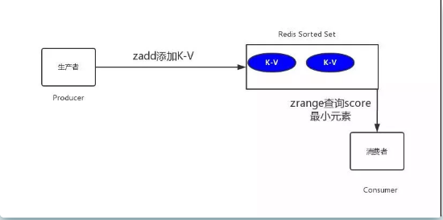

##**Redis 延时任务**

延时任务场景：
1.生成订单30分钟未支付，取消订单
2.订单生成60秒后，发送短信给用户


##**延时任务与定时任务区别**
1.定时任务有明确的触发时间，延时任务没有
2.定时任务有执行周期，而延时任务在某事件触发后一段时间内执行，没有执行周期
3.定时任务一般执行的是批处理操作是多个任务，而延时任务一般是单个任务

##**解决方案**
（1）数据库轮询
在小型项目中使用，通过一个线程定时去扫描，通过订单时间来判断是否有超时的订单，然后进行update或delete等操作

####redis缓存
利用redis的有序集合 zset ,每一个元素(member)都关联了一个score,通过score排序来取集合中的值

* 加元素:ZADD key score member [[score member] [score member] …]
* 按顺序查询元素:ZRANGE key start stop [WITHSCORES]
* 查询元素：score:ZSCORE key member
* 移除元素:ZREM key member [member …]

````
# 添加单个元素
redis> ZADD page_rank 10 google.com
(integer) 1
# 添加多个元素
redis> ZADD page_rank 9 baidu.com 8 bing.com
(integer) 2
redis> ZRANGE page_rank 0 -1 WITHSCORES
1) "bing.com"
2) "8"
3) "baidu.com"
4) "9"
5) "google.com"
6) "10"
# 查询元素的score值
redis> ZSCORE page_rank bing.com
"8"
# 移除单个元素
redis> ZREM page_rank google.com
(integer) 1
redis> ZRANGE page_rank 0 -1 WITHSCORES
1) "bing.com"
2) "8"
3) "baidu.com"
4) "9"
````
订单超时延时队列redis实现
